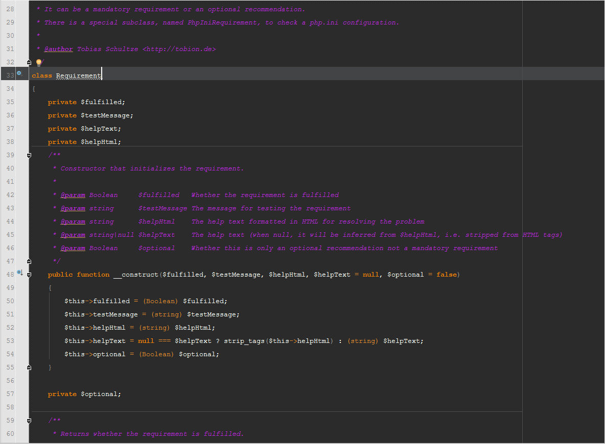

# About

**Symfony2.icls:** Created in an attempt to mimic the color scheme seen in examples throughout the Symfony2 docs.

# Compatibility

**Symfony2.icls:** PhpStorm 6.x

# Installation

 1. Copy the ICLS file to PhpStorm's `colors` directory.

      **OSX:** `~/Library/Preferences/WebIde60/colors/`

      **Windows:** `C:\Users\{{username}}\.WebIde60\config\colors\`

      **Linux:** `~/.WebIde60/config/colors/`

 2. Open PhpStorm
 3. Open Settings [File -> Settings]
 4. Click "Editor -> Colors & Fonts" in the left-side tree.
 5. Change the scheme dropdown to `Symfony2`.
